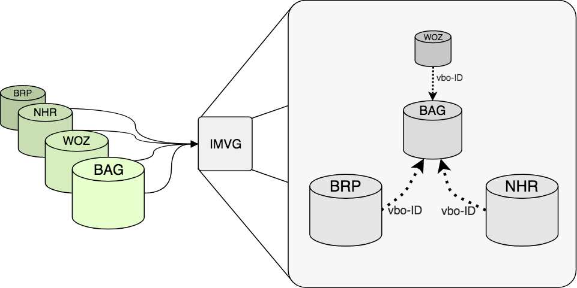
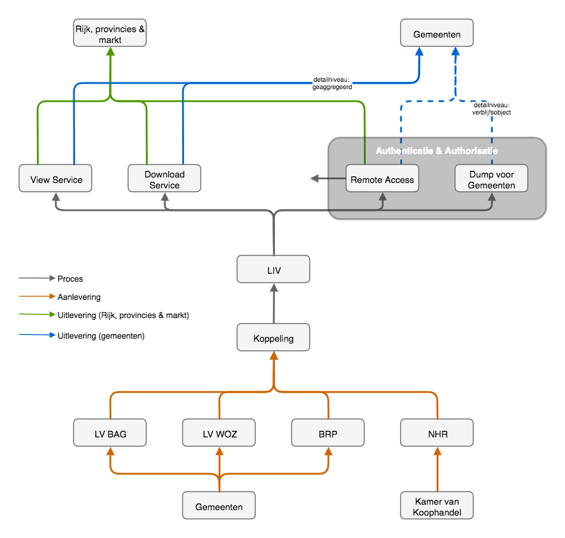

# Overview

Dit hoofdstuk geeft een overzicht van de <mark>[invullen]</mark>

## Naam en Acroniemen
- IMVG - Dataspecificatie voor vastgoedgebruiksinformatie
- Informatiemodel Vastgoedgebruik - Dataspecificatie voor het dataproduct Landelijke Informatievoorziening Vastgoedgebruik (LIV)

<!--Doelstelling
Het doel is om in februari 2018 te komen tot een nieuwe landelijke monitor leegstand 2.0, waarin de bevindingen van diverse plausibiliteitsonderzoeken zo veel mogelijk zijn verwerkt. Tevens wordt een processtandaard opgeleverd, gepubliceerd en in beheer genomen. Verder wordt de mogelijke dienstverlening aan partijen inzichtelijk gemaakt.-->

<h2 id="informeleBeschrijving">Informele beschrijving</h2>
Deze paragraaf gaat uitgebreid in op de gehanteerde definities en gebruikte bronnen.

### Definitie
Voor de definitie van begrippen in het IMVG is ervoor gekozen om steeds zo dicht mogelijk bij de bron te blijven <!--weglaten: (zie: definitie van administratieve leegstand)-->en de informatie zo objectief mogelijk weer te geven. <!--toevoeging uit andere bron -->In de praktijk zien we meerdere definities van het begrip leegstand, die soms onderling conflicteren. Het IMVG heeft specifiek betrekking <a href="#administratieveLeegstand" title="Ga naar: definitie administratieve leegstand">administratieve leegstand</a>. Deze definitie wijkt af van de <a href="#feitelijkeLeegstand" title="Ga naar: definitie feitelijke leegstand">feitelijke leegstand</a>. <!--Dus geen termen als frictie-, langdurige of structurele leegstand, maar de factor tijd publiceren. Bijvoorbeeld door het tijdstip van het meetmoment te publiceren in plaats van een waardeoordeel over het tijdsmoment (langer dan 3 jaar niet in gebruik: structurele leegstand).-->

### Beschrijving
Het Informatiemodel Vastgoedgebruik vormt het gemeenschappelijke begrippenkader voor de uitwisseling van informatie over vastgoedobjecten. De totale verzameling van vastgoedobjecten in Nederland is de gebouwenvoorraad. Deze bestaat onder andere uit woningen, winkels, kantoren, scholen, ziekenhuizen, fabrieken, winkels en sportfaciliteiten. Het IMVG beschrijft op een uniforme manier het *gebruik* van al het *formeel geregistreerde vastgoed* op het Nederlandse grondgebied (vasteland). De volgende paragraaf licht dit verder toe.

### Toelichting

Formeel geregistreerd betekent in dit geval de registratie van informatie over (het gebruik van) vastgoedobjecten zoals die is vastgelegd in de basisregistraties. Het vastgoed in deze voorziening omvat alle <a href="#bagPand" title="Ga naar: definitie BAG-pand">panden</a> met een <a href="#bagVbo" title="Ga naar: definitie BAG-vbo">verblijfsobject</a>. Het IMVG richt zich in eerste instantie op het vaststellen en classificeren van administratief gebruik.

In deze versie van het informatiomodel gaat de aandacht uit naar dat deel van de gebouwenvoorraad dat administratief *niet in gebruik* is, ofwel: dat administratief leegstaat. De koppeling tussen basisregistraties geeft inzicht in het administratieve gebruik op het niveau van een verblijfsobject (BAG). Stand- en ligplaatsen vallen buiten de scope van de informatievoorziening.

Om administratief gebruik vast te stellen, koppelt het IMVG de WOZ, NHR en BRP aan de BAG. Deze registraties geven een indicatie van de gebruiksstatus van het verblijfsobject. In het IMVG is er sprake van *administratieve leegstand* op het moment dat er op een verblijfsobject geen registratie is van een *gebruiker* in de WOZ<!--[<mark>wozOnderscheid</mark>]-->, een *vestiging* in het NHR en een *persoon* in de BRP. Daarnaast bevatten sommige registraties relevante extra informatie.

In het verlengde van een integrale benadering, ligt een uniforme benadering. Hoewel er verschillende partijen zijn die naar het gebruik van vastgoed kijken en daarover publiceren, is er onderling geen consensus over de methode en de definities. Daarom heeft een brede groep partijen de wens geuit om hierover afspraken te maken. Het Informatiemodel Vastgoedgebruik legt deze afspraken op uniforme manier vast.

<!--[<mark>wozOnderscheid</mark>] Voor woningen wordt niet meer apart onderscheid gemaakt tussen een *eigenaar* en een *gebruiker*. In de praktijk is de WOZ-registratie voornamelijk relevantie voor alle typen *niet-woningen*. Woningen zitten al goed in de registratie op basis van de BRP. De aanname is dat het effect van het ontbreken van WOZ-informatie voor de categorie *woningen* beperkt is. Doordat deze informatie ontbreekt, is het exacte effect ervan onbekend.
Indien een situatie niet aan één van deze drie criteria voldoet, is er geen sprake van *administratieve leegstand* volgens de LIV. In alle andere gevallen wordt aangenomen dat er sprake is van gebruik.-->

**Integrale benadering**

Een belangrijk onderdeel van deze aanpak is de nadruk op het integrale karakter van de voorziening. Dat wil zeggen dat de volledige vastgoedpopulatie wordt meegenomen. Bestaande informatievoorzieningen richten zich vaak op een specifiek deel van het vastgoed, bijvoorbeeld kantoren of winkels. Ondanks de voordelen die dit heeft voor de marktspecifieke informatiebehoefte, zijn er ook nadelen. Het blijkt lastig om informatie tussen deze voorziening uit te wisselen. Bovendien bestaat niet voor alle typen vastgoed een informatievoorziening.

Om verschillende redenen bleek het relevant om informatie over verschillende vastgoedtypen in een bepaald gebied te kunnen relateren <mark>[link naar eerdere rapport(en)]</mark>. Gemeenten en provincies zijn bijvoorbeeld verplicht de Ladder Duurzame Verstedelijking toe te passen voor het in kaart brengen van de ruimtebehoefte. Op die manier ligt het belang van integraal inzicht in feite verankerd in een wettelijk basis.

Het gebruik van een pand (zowel vergund als feitelijk) zegt respectievelijk iets over het oorspronkelijke gebruiksdoel en het huidige gebruik. Als iets leegstaat kan het zijn dat het object leegstaat als gevolg van bijvoorbeeld overaanbod voor die specifieke functie, terwijl er aan andere functies misschien een tekort is. In zulke gevallen is het relevant om vraag en aanbod van ruimte integraal aan elkaar te relateren.

**Over de BAG**

In Nederland registreert de overheid "*alle met "gebouwen" samenhangende objecten*" in de Basisregistratie Adressen en Gebouwen (BAG). Deze objecten zijn afgebakend en voorzien van een unieke aanduiding. De BAG onderscheidt de volgende vier objecten en legt hiervan de gegevens vast: *panden*, *verblijfsobjecten*, *standplaatsen* en *ligplaatsen*.
<!-- BAG-2009-2014_objectenhandboek -->

<!-- **Note:** hierop aanvullen dat voor LIV *standplaatsen* en *ligplaatsten* niet meegenomen worden. Is het logisch dat we deze niet meenemen? Ja: want geen gebruiksfunctie? Nee, want soms wel gebruiksfunctie
Uit: BAG_2009-2014_objectenhandboek - *Daarnaast bevat de basisregistratie gebouwen (permanente) ligplaatsen van woonboten en (permanente) standplaatsen van woonwagens.* -->

<!--Op een rij:
elke stand- en ligplaats is een pand in de BAG
verblijfsobjecten, stand- en ligplaatsen zijn adresseerbare objecten -->

<!--Reeds herschreven-->
Wat opvalt is dat de BAG *panden* definieert in plaats van *gebouwen*. Dit komt omdat de definitie van het object "gebouw" onvoldoende aansloot op de gewenste toepassing van een gebouwenregistraties [<mark>bron: BAG 2009-2014</mark>].

<!--Reeds herschreven-->
De BAG voegt in feite twee samenhangende basisregistraties samen: de Basisregistratie Adresssen (BRA) en de Basisgebouwenregistratie (BGR) [<mark>bron: [Kadaster](https://www.kadaster.nl/basisregistratie-gebouwen)</mark>]. Het gegevensmodel van de BGR maakt onderscheid tussen (kleinste) bouwkundige eenheden (<a href="#bagPand" title="Ga naar: definitie BAG-pand">panden</a>) en (kleinste) gebruikseenheden (<a href="#bagVbo" title="Ga naar: definitie BAG-vbo">verblijfsobjecten</a>). Hoewel er tussen beide objecten relaties bestaan, bakent de BGR een pand onafhankelijk af van een verblijfsobject. Een verblijfsobject maakt altijd deel uit van één of meerdere panden, maar een pand hoeft geen verblijfsobject te bevatten [<mark>bron: BAG 2009-2014, p.23</mark>].

Een verblijfsobject moet volgens de definitie functioneel zelfstandig zijn. Dit heeft belangrijke consequenties voor informatie over vastgoedgebruik. Niet elk pand heeft één (of meerdere) verblijfsobject(en); sommige gebouwen hebben namelijk een ondersteunende functie voor een ander gebouw <!--[<mark>ondersteunendeFuncties</mark>]--> <!-- BAG-2009-2014_objectenhandboek -->. Deze *ongeadreseerde* gebouwen of *bij*gebouwen zijn in een aantal gevallen eveneens relevant voor het in kaart brengen van vastgoedgebruik<!--[<mark>bijgebouwen</mark>]-->. Het Kadaster deed onderzoek naar deze mogelijkheid [<mark>link naar rapport Kadaster</mark>]. De huidige versie van het IMVG neemt bijgebouwen niet mee.

<!--[<mark>ondersteunendeFuncties</mark>] Voorbeelden zijn: vrijstaande garageboxen, schuren, silo's, stallen, schaapskooien of toiletgebouwen op campings--> <!-- BAG-2009-2014_objectenhandboek-->.

<!--[<mark>bijgebouwen</mark>] Bijvoorbeeld in het geval van agrarische bedrijven. Die bestaan vaak uit meerdere vastgoedobjecten. Sommige van deze objecten hebben een verblijfsobject (boerderij) maar anderen niet (schuren, stallen, silo's etc.). Steeds meer agrarische bedrijven stoppen [<mark>bron</mark>]. Vaak komen de bijgebouwen dan leeg te staan, terwijl de boerderij bewoond blijft. Omdat de bijgebouwen niet (apart) geadresseerd zijn, is op basis van de BAG niet vast te stellen wat de gebruiksstatus van elk afzonderlijk object is.-->

Een verblijfsobject in de BAG heeft een <a href="#bagGebruiksdoel" title="Ga naar: definitie BAG-gebruiksfunctie">gebruiksfunctie</a>. Dit type gebruik wordt ook wel het vergunde gebruik genoemd. Zo is voor elk verblijfsobject tenminste één gebruiksdoel vastgesteld<!--[<mark>dubbelfunctie</mark>]-->. Het gebruiksdoel is daarom geschikt voor een rudimentaire classificatie<!--[<mark>gebruiksdoelen</mark>]--> van verblijfsobjecten. <!--[<mark>dubbelfunctie</mark>] In sommige gevallen kan de bronhouder (gemeente) ervoor kiezen om een zogenaamde dubbelfunctie toe te kennen, bijvoorbeeld: woon-/winkelfunctie.--><!--[<mark>gebruiksdoelen</mark>] De BAG onderscheidt 11 gebruiksdoelen: woon-, bijeekomst-, cel-, gezondheid-, industrie-, kantoor-, logies-, onderwijs-, sport-, winkel- en overige gebruiksfunctie. Deze indeling sluit niet altijd goed aan bij de praktijk. Agrarisch vastgoed wordt in deze classificatie bijvoorbeeld niet apart onderscheiden, maar valt onder industriefunctie.-->Kortom, het onderscheid naar verblijfsobjecten is op twee manieren relevant voor het Informatiemodel Vastgoedgebruik: [**1**] om het gebruik van een (deel van) een vastgoedobject (pand) vast te stellen, en [**2**] om binnen een vastgoedobject (pand) het type gebruik per eenheid te kunnen onderscheiden.

**Dataspecificatie: bronnen en producten**

Het IMVG haalt gegevens op uit (delen van) vier bronbestanden (BAG, WOZ, NHR en BRP) en koppelt de gegevens aan elkaar op basis van de verblijfsobjectidentificatie (vbo-ID) uit de BAG (zie: <mark>figuur 1</mark>). Het vbo-ID is één van de <a href="http://www.stelselvanbasisregistraties.nl/authentieke_gegevens/" title="Ga naar: definitie authentieke gegevens in stelselcatalogus">authentieke gegevens</a> uit de BAG, die de andere bronnen vanuit de <a href="https://www.digitaleoverheid.nl/beleid/naar-een-gegevenslandschap/themas/stelselafspraken/" title="Ga naar: Stelselafspraken">stelselverplichting</a> gebruiken.

<figure>
	
	<figcaption> - Dataspecificatie IMVG bronnen en producten (klik voor vergroting)</figcaption>
</figure>

De BAG vormt daarmee het middelpunt van de informatievoorziening. De koppeling vindt plaats op vbo-id (kleinste gebruikseenheid). Daarbij is het pand is als de (kleinste) bouwkundige eenheid een belangrijk object.  De wens van gebruikers van de informatievoorziening is om op verblijfsobjectniveau te kunnen zien wat de administratieve gebruiksstatus is binnen het pand. Bovendien blijkt uit een [pilot](https://www.geonovum.nl/sites/default/files/methodiek_stappenplan_leegstand.pdf) dat bij [visualisatie van leegstand op objectniveau](http://maps.objectvision.nl/hoornleegstand/?layers=OPENBASISKAART,Hoorn_GEBRUIKSDOEL_ALLE,&zoom=9&lat=518900&lon=133200&language=nl) het hoge detailniveau en het type geometrie ("Point") van verblijfsobjecten de leesbaarheid bemoeilijkt, waardoor [aggregatie naar pandniveau](http://maps.objectvision.nl/hoornleegstand/?layers=OPENBASISKAART,Hoorn_GEBRUIKSDOEL_ALLE,&zoom=9&lat=518900&lon=133200&language=nl) (geometrie: "Polygon") wenselijk is.

**Uitgangspunten**

* beschrijft totaalpakket aan informatie dat voorzien in een <mark>aantal datafunctionaliteiten</mark>:
* bevat ***geen*** specificatie van de datafunctionaliteiten zelf 
* semantische afstemming [<mark>in hoeverre en op welke manier relevant?</mark>]
* beschrijft de informatievoorziening. Het bevat geen beschrijving van de 'eindproducten', danwel (data)functionaliteiten waarvoor de LIV als basis dient.
* voorzien in een objectgerichte, gevectoriseerde data-uitwisseling
* Afhankelijk van type informatieproduct kan LIV toegepast worden in *view service* (WMS) of *download service* (WFS of Atom feeds [csv, excel?])[<mark>weglaten?</mark>].
* geen 3D-geometrie toegepast [<mark>voor lange termijn wel relevant: nog rekening houden met aanknopingspunten?</mark>]
* voegt geen nieuwe geometrie toe? [<mark>wel nieuwe info, zeker naar verloop van tijd</mark>]
* bevat ook temporele informatie? [<mark>waarschijnlijk niet, tenzij datum/tijd geldigheid object of de historie die weopbouwen daaronder vallen</mark>]
* differentiatie van informatie: hoe en waar geregeld?
* integraal
* uniform
* eenduidige definitie van leegstand (administratief, structureel, tijdelijk, gedeeltelijk, verborgen) en van vastgoedcategorieën, maar (nog) geen andere definities)
* historie opbouwen zodat je over periodes (in eerste instantie jaren) heen kunt vergelijken
* landsdekkend
* [<mark>*etc.*</mark>]

<!-- Belangrijke criteria: toevoegen aan 'uitgangspunten'?
Alle panden samen vormen de gebouwenvoorraad.
Niet elk pand heeft een verblijfsobject.
Voor leegstand gebruik wil je (mogelijk) ook uitspraak doen over bijgebouwen
Een verblijfsobject heeft tenminste één gebruiksdoel
De ... -->

<!-- **Note:** lijst van objecten die geen pand en geen verblijfsobject zijn, zie: BAG_2009-2014_objectenhandboek, p. 82/96 -->
**Data-uitwisselingsarchitectuur**

Het volgende figuur toont de data-uitwisselingsarchitectuur waarvan het IMVG onderdeel uitmaakt. Het figuur dient ter illustratie van informatiestroom van bronhouder tot eindproduct en niet normatief voor de implementatie van de voorziening. Het figuur onderscheidt data-uitlevering en data-aanlevering. Data-levering heeft betrekking op het leveren van data aan de uiteindelijke afnemers. Data-aanlevering is de aanlevering van data door bronhouders ten behoeve van de realistie van de tussenproducten of voorzieningen die met die gegevens in staat zijn om eindproducten te realiseren.

<figure>
	
	<figcaption> - IMVG Data-uitwisselingsarchitectuur (klik voor vergroting)</figcaption>
</figure>

Voor de BAG, de WOZ en de BRP zijn de gemeenten bronhouder en voor het NHR is dat de Kamer van Koophandel. Zij verzamelen en beheren de gegevens in de basisregistraties. Behalve voor de BRP, zijn deze bronnen ontsloten via een landelijke voorziening <!--Als laag toevoegen in het model?-->. De landelijke voorziening levert gegevens aan een centrale database die de verschillende bronnen aan elkaar koppelt met behulp van het vbo-ID. Op die manier is het mogelijk om per verblijfsobject de adminsitratieve gebruiksstatus vast te stellen. Het resultaat hiervan is de Landelijke Informatievoorziening Vastgoedgebruik (LIV). De gegevens uit de LIV. worden via een authorisatielaag door verschillende functies aangeroepen. Daarbinnen wordt onderscheidt gemaakt tussen functionaliteiten voor zowel alle overheden als marktpartijen en functionaliteiten die exclusief aan gemeenten toebehoren (zie: figuur 3).<!--Dat laatste klopt nog niet helemaal, want voor gemeenten inderdaad authorisatie bij CBS. Voor remote access (woonzorg=remote access) waarschijnlijk ook, maar tussen gemeenten en remote access is wel onderling verschil.-->
<figure>
	
	<figcaption> - Type voorzieningen binnen het dataproduct Landelijke Informatievoorziening Vastgoedgebruik (klik voor vergroting)</figcaption>
</figure>

## Normatieve referenties
## Totstandkoming

### Algemeen
In 2015 voerden het Kadaster en Geonovum gezamenlijk onderzoek uit naar behoefte aan leegstandsinformatie bij marktpartijen en overheden. Daaruit bleek een duidelijke behoefte, bij marktpartijen en overheden, aan een geüniformeerde methodiek en aan eenduidige definities. Het vervolgonderzoek uit 2016 bevestigde dat beeld. Vanuit gebruiksoptiek en vanuit informatiekundig perspectief is het van belang deze methodiek en definities goed vast te leggen in een informatiestandaard. Het doel van een informatiestandaard is om te komen tot een geüniformeerde wijze voor het beschrijven van de semantische inhoud van de registraties. Deze wijze van beschrijven gebeurt door middel van deze dataspecificatie. Die beschrijft in detail de data-inhoud van de informatievoorziening en de dataproducten die worden geleverd. Centraal in een hierin staat het informatiemodel. Dit zet de afspraken over begrippen en definities van gegevens binnen een bepaald domein schematisch op een rij. Dit helpt om de uitwisseling van informatie te vereenvoudigen.

### Ontwikkeling standaard
**Bronnen**
- BRP: 20161024 Verstuffingversie InfoMod RSGB.EAP [<mark>gewijzigd</mark>]
- BAG: 2017-02-10_IMBAG_UML_KKG_InOnderzoek_metagegevens.EAP
- WOZ: imwoz 2012 08 31 11.30 technisch.EAP
- NHR: Online Catalogus v3.01 Overheid (html)

#### Stelsel van Basisregistraties

In het kader van hergebruik van informatie neemt het Informatiemodel Vastgoedgebruik het stelsel van basisregistraties als vertrekpunt. Ook voor de ontwikkeling van het informatiemodel kan op die manier gebruik gemaakt worden van bijbehorende bestaande datastructuren. Niet alleen zijn deze datastructuren reeds ontwikkeld, vanuit de stelselgedachte zijn ze ook al op elkaar afgestemd.

#### KKG

Het KKG is een metamodel voor informatiemodellering dat KING, Kadaster en Geonovum (KKG) gezamenlijk hebben ontwikkeld. Hierin bundelen de drie organisaties hun kennis ten aanzien van informatiemodellering. Het metamodel richt zich op registraties binnen het overheidsdomein, maar is in bredere context inzetbaar ([<mark>bron: Geonovum</mark>](https://www.geonovum.nl/geo-standaarden/metamodel-informatiemodellering/nationaal-metamodel-voor-informatiemodellering)). Het IMVG sluit waar mogelijk aan op het KKG metamodel, in sommige gevallen is vastgehouden aan een specifice modelleerconventie binnen een model.

#### Knelpunten bij (operationele) uitvoering

Bij de ontwikkeling van het informatiemodel, kwamen er een aantal uitdagingen aan het licht. Van de vier basisregistraties was alleen een informatiemodel van de BAG beschikbaar die volgens het KKG metamodel was gemodelleerd. <!--De informatiemodellen van de WOZ, NHR en BRP waren nog vanuit eerdere inzichten opgebouwd.--> 

**Formaten**

Van sommige basisregistraties waren meerdere modellen beschikbaar waarbij niet zonder meer duidelijk was welk model het meest toereikend zou zijn.
Niet van alle modellen UML beschikbaar in Enterprice Architect (EA). Van de BAG en WOZ waren deze wel beschikbaar, maar van NHR en BRP niet. 

**NHR**

Het informatiemodel van het NHR was wel beschikbaar als UML in html-formaat. Officieel is bij de Kamer van Koophandel ook een EA-versie, maar dit model wordt niet met andere partijen gedeeld. 

**BRP**

Operatie BRP is <mark>...</mark> maar daar is de stekker uitgetrokken, en daarom geen model beschikbaar. De Rijksdienst voor Identiteitsgegevens (beheerder van de BRP) verwees voor de benodigde informatie naar het Logisch Ontwerp BRP; een document in pdf-formaat.

Echter dat document heeft niet als belangrijkste doel om de datastructuur van de BRP te specificeren. Desondanks staat er wel relevante informatie in. Via de Referentiemodel Stelsel van Gemeentelijke Basisgegevens (RSGB) hebben is het model van Gemeentelijke Basis Administie verkregen.

Het BRP registreert ook niet-ingezetenen (personen in het buitenland). Deze zijn voor de het IMVG niet relevant. Het GBA volstaat voor het Informatiemodel Vastgoedgebruik. Het lastige is dat vanuit het GBA in het RSGB geen duidelijke link gelegd wordt met de BAG [<mark>klopt dat?</mark>]. In combinatie met het Logisch Ontwerp van de BRP is wel af te leiden waar die verbinding moet liggen.

**WOZ**

Het WOZ-model komt uit 2012. De LIV maakt specifiek gebruik van de Landelijke Voorziening WOZ (LV WOZ). Hoewel er geen grote wijzigingen hebben plaatsgevonden, kan het model op kleine punten afwijken van de huidige situatie. Verder is het UML-model van de WOZ mogelijk vanuit andere software in EA geïmporteerd, want de diagrammen waren zeer moeilijk leesbaar.

**Meerdere modelleerconventies binnen één model**

Verder zien we dat binnen één model soms op twee verschillende manieren hetzeldfe gemodelleerd is. Mogelijk is hiervoor een goede reden, maar het maakt het model wel. Ook tussen de modellen gelden verschillende modelleeerconventies. In het LIV hebben we waar mogeiljk de oorspronkelijke modellen zoveel mogelijk overgenomen. Verschillen kunnen optreden op het koppelvlak met de BAG.

**Koppelvlakken**

In het stelsel zijn de BRP, WOZ en het NHR aan de BAG gekoppeld. Het was echter lastig om die structuur goed uit de modellen terug te lezen omdat er niet op een éénduidige manier werd gerefereerd. Om de modellen op elkaar aan te laten sluiten, moesten daarom keuzes gemaakt worden. <!-- dit moet zich nog verder uitkristaliseren -->

**Discrepantie IMVG en LIV**

Transparantie en reproduceerbaarheid zijn altijd een belangrijk speerpunt van het IMVG en de LIV geweest, maar naarmate het onderzoek vorderde, werden we geconfronteerd met een lastige tegenstelling: kwaliteit van de cijfers versus transparantie en reproduceerbaarheid van de methodiek. 

Het CBS heeft voor statistische doeleinden toegang tot de informatie uit de  basisregistraties. Om verschillende redenen maakt het CBS eerst een kwaliteitsslag op de ruwe data. Deze stap gebeurt buiten het project om en geldt als input voor alle CBS-afdelingen die gebruik maken van de data. Het voordeel vis dat de kwaliteit van de broninformatie door deze bewerking toeneemt. Het heeft echter ook consequenties voor de transparantie en reproduceerbaarheid van de methodiek.

Een poging om de gemaakte keuzes en gebruikte aanvullende data uit de voorberwerking in beeld te brengen, toonde aan dat het een complexe stap is, die veel tijd en moeite zou kosten die binnen het project niet aanwezig waren. Bovendien was de vraag of van deze bewerkte bronnen ook informatiemodellen aanwezig waren. In hoeverre en in welke mate dit tot verschillen leidt, is daarom onduidelijk. 

Wat we wel weten is dat de bewerking op het handelsregister het meest complex is. Daarvoor zullen de verschillen tussen ruwe en bewerkte data dus het grootst zijn. Om de kwaliteit van de cijfers te verbeteren wordt nagebeld en een koppeling gemaakt met informatie van buiten de vier basisregistraties. 

Er is daarom een pragmatische keuze gemaakt. Eerdere cijfers die in het kader van de LIV door het CBS gepubliceerd zijn, vonden op dezelfde brondata plaats. Bovendien gaat het om een bewerking die de kwaliteit van de cijfers verbetert. Daarom is besloten om hierop voort te bouwen. Deze dataspecificatie sluit zo dicht mogelijk aan bij deze methodiek, maar wijkt op een aantal kleine punten af. <!--[a] Dit opnemen? [b] Vraagt deze formulering niet om een toelichting? -->  

## Termen en Definities
Lijst van termen en definities die in deze beschrijving worden gehanteerd.

**activiteit**

> "De activiteit van een natuurlijk persoon of niet-natuurlijk persoon. Activiteiten worden geregistreerd bij de rechtspersoon of bij de vestigingen. Bij zowel de maatschappelijke activiteit als de onderneming wordt de verzameling van Standaard Bedrijfsindeling (SBI)-codes gegroepeerd.
- Maatschappelijke Activiteit: De totale verzameling van SBI-codes die betrekking hebben op de rechtspersoon of op de niet-commerciële vestigingen.
- Onderneming: De verzameling van SBI-codes die betrekking hebben op een Onderneming. Dit is de verzameling van alle SBI-codes die worden uitgeoefend op de commerciële vestigingen"[<mark>bron: NHR 2013, p. 9-28</mark>].

<b id="administratieveLeegstand">administratieve leegstand</b>

> De situatie waarin de koppeling van de basisregistraties WOZ, NHR en BRP aan de BAG respectievelijk: geen gebruiker(s), geen relatie(s) met een vestiging en geen relatie(s) met een persoon oplevert (zie: combinatie 8 in <mark>figuur 4</mark>)

**adresseerbaar object** <!--oorsprong definitie?-->

> Objecten waaraan in de BAG een adres kan worden toegekend: standplaats, ligplaats of verblijfsobject [<mark>bron: BAG 2009-2014, p. 24</mark>]

**annotatie**

> Elke toevoeging op een kaartbeeld voor verduidelijking

**applicatieschema**

> informatiemodel dat gegevens beschrijft die worden gebruikt door een of meer applicaties. IMKL is met UML beschreven in een applicatieschema.

**associatie of relatie (UML)**

> semantische relatie tussen twee of meer klassen die de connectie tussen hun instanties weergeeft

**attribuut**

> kenmerk van een object

**attribuutwaarde (value)**
> waarde die een attribuut aanneemt

**bag-object**

> "De BAG is op­ge­bouwd uit de vol­gen­de soor­ten ob­ject­ty­pen: woon­plaats, open­ba­re ruim­te, num­mer­aan­dui­ding, stand­plaats, lig­plaats, ver­blijfs­ob­ject, pand" [<mark>bron: [Gemeente Amsterdam](https://www.amsterdam.nl/stelselpedia/woordenboek/)|definitie relevant?</mark>]

**coördinaat**

> getal in een sequentie van n getallen om de positie van een punt in een n-dimensionale ruimte te bepalen

**coördinaatreferentiesysteem**

> coördinaatsysteem dat aan een object is gerelateerd door een datum.

**coördinaatsysteem**

> set van wiskundige regels voor het toekennen van coördinaten aan punten

**datatype**

> gestructureerde gegevens zonder identiteit

**datum**

> parameter of set van parameters voor het definiëren van het nulpunt, de schaal en de oriëntatie van een
coördinaatsysteem

**diepte**

> Afstand van een punt tot een gekozen referentievlak neerwaarts gemeten langs een lijn welke loodrecht
op dat referentievlak staat.

**download service**

> service that enables copies of spatial data sets, or parts of such sets, to be downloaded and, where
practicable, accessed directly.
INSPIRE

**extensie (van informatiemodel)**

> Een informatiemodel als uitbreiding op een ander informatiemodel

<b id="feitelijkeLeegstand">feitelijke leegstand</b>

> Een eenduidige definitie ontbreekt. Sectorspecifieke leegstandsdefinities wijken af van de definitie in het IMVG. In het buitengebied ontbreekt bijvoorbeeld een eenduidige relatie tussen *administratie leegstand* en *vrijkomende agrarische bebouwing* (VAB); vastgoed dat in de toekomst leeg kan komen te staan. In de commerciële markt gaat het vaak om *beschikbaarheid* van vastgoed. Als er een object wordt aangeboden voor een nieuwe gebruiker, wordt dat in de commerciële vastgoedmarkten vaak geassocieerd met *economische* of *financiële leegstand*. Het object hoeft in dat geval niet zichtbaar leeg te staan. Voor publieke partijen heeft leegstand vaak de associatie met *verpaupering* en *verloedering*. Ook hier is de relatie met administratieve leegstand niet eenduidig. <!--De kans is groot dat problematische leegstand administratief leeg is, maar we weten inmiddels dat het omgekeerde lang niet altijd waar is.-->Er is derhalve geen objectief kader voor (feitelijke) leegstand.

**gebruiker**

> De (rechts-)persoon die door de gemeente is aangewezen "belanghebbende gebruiker" van het WOZ-object [<mark>bron: WOZ 2012, p. 21</mark>].

<b id="bagGebruiksdoel">gebruiksdoel</b>

> "Een categorisering van de gebruiksdoelen van het betreffende
verblijfsobject, zoals dit door de overheid als zodanig is
toegestaan" [<mark>bron: BAG 2009, p. 60</mark>].

> "Het gebruiksdoel zal initieel worden afgeleid uit de bouwkundige gebruiksfunctie conform de categorisering van het Bouwbesluit 2003 zoals deze in de bouwvergunning als zodanig is aangemerkt. Op een later moment kunnen ook door de gemeente geformaliseerde gebruiswijzigingen als basis dienen voor opnamen van een aanvulend gebruiksdoel. Het gebruiksdoel dient niet te worden verward met de *planologische bestemming* en het *feitelijk gebruik*". [<mark>bron: BAG 2009, p. 61</mark>]

**geo-informatie (geo-information, geographic information)**

> informatie met een directe of indirecte referentie naar een plaats ten opzichte van de aarde (bijvoorbeeld
ten opzichte van het aardoppervlak).Geo-informatie is synoniem aan geografische informatie.

**geo-object (geographic feature type, feature class)**

> abstractie van een fenomeen in de werkelijkheid dat direct of indirect is geassocieerd met een locatie
relatief ten opzichte van de aarde (bijvoorbeeld ten opzichte van het aardoppervlak)

**georeferentie (georeference)**

> locatie van een ruimtelijk object vastgelegd in een ruimtelijk referentiesysteem

**informatiemodel (conceptual model, conceptual scheme)**

> formele definitie van objecten, attributen, relaties en regels in een bepaald domein.  Domein is in dit verband: een kennisgebied of activiteit gekarakteriseerd door een
verzameling van concepten en begrippen

**instantie (instance, occurrence)**

> benoemd, identificeerbaar object uit een objectklasse

**label**

> tekst of getal dat een eigenschap omschrijft of kwantificeert en als annotatie op een kaartbeeld wordt
afgebeeld

**namespace**

> collectie van namen die in XML documenten gebruikt worden als element en attribuutnamen. Een namespace wordt geïdentificeerd door een URI.

**netwerk service**

> "_application running at the network application layer and above, that provides data storage, manipulation,
presentation, communication or other capability which is often implemented using a client-server or peerto-
peer architecture based on application layer network protocols_" - (Wikipedia)

**objectklasse (feature class)**

> verzameling van objecten met dezelfde eigenschappen

<b id="#bagPand">pand</b><!-- (Wet basisregistraties adressen en gebouwen, artikel 1, lid o)-->

> "de kleinste bij de totstandkoming functioneel en bouwkundig-constructief zelfstandige eenheid die direct en duurzaam met de aarde is verbonden en betreedbaar en afsluitbaar is" [<mark>bron: BAG 2009, p. 13</mark>].

**persoon**

> "Inwoner van Nederland (ingezetene)" [<mark>bron: [Rijksoverheid](https://www.rijksoverheid.nl/onderwerpen/privacy-en-persoonsgegevens/vraag-en-antwoord/gegevens-basisadministratie-personen)</mark>]

<!--Gegevens over de ingeschrevene (toelichting uit BRP)
iets met **ingezetenen**, **natuurlijk persoon**, ingeschreven in Nederland met BSN, alle kinderen, ouders en partners ??? Nog geen duidelijke definitie gevonden.-->

**presentatie**

> presentatie van informatie aan mensen
Presentatie van informatie door visualisatie, hoorbaar maken, tastbaar maken (tactiel) of
combinaties hiervan.

**productmodel**

> informatiemodel afgeleid van een ander informatiemodel om de toepassing in een dataproduct te
realiseren

**registratie**

> op nationaal niveau geïdentificeerde en erkende gegevensverzameling
Een basisregistratie is een registratie.

**registratiehouder**

> organisatie verantwoordelijk voor het houden van de registratie
de registratiehouder is de organisatie die unieke objectidentificaties toekent voor
objecten in een registratie

**representatie**

> inhoudelijk vastleggen van de werkelijkheid. Het informatiemodel is een representatie van de werkelijkheid.

**ruimtelijk referentiesysteem**

> model (systeem) voor identificatie van een positie (locatie) in de werkelijkheid. Identificatie van een positie kan door coördinaten (directe locatie) en door geografische
identificatoren (indirecte locatie).

**sectormodel**

> model voor beschrijving van de werkelijkheid binnen het domein van een beleidsveld

**symbool**

> presentatieprimitieve van grafische, audio of tactiele aard of een combinatie hiervan

**temporeel referentiesysteem**

> Referentiesysteem waarin de tijd is bepaald.

**netwerktopologie**

> beschrijving van de plaats van de knooppunten en de onderlinge verbindingen in een netwerk

**rasterformaat**

> representatie van beeld middel een gewoonlijk rechthoekig patroon van parallelle lijnen (v)

**vastgoedgebruik**

> De situaties waarin een koppeling van de WOZ, het NHR en de BRP aan de BAG in tenminste één gebruiker, of één relatie met een vestiging of één relatie met één persoon oplevert (<mark>combinatie 1 t/m 7 in tabel x.x §3.1.6</mark>).

**vastgoedobject**

> Een BAG-pand met een verblijfsobject (stand- en ligplaatsen zijn uitgesloten)

**vectorformaat**

<b id="bagVbo">verblijfsobject</b><!--(Wet basisregistraties adressen en gebouwen, artikel 1, lid q)-->

> "De kleinste binnen één of meer panden gelegen en voor woon-, bedrijfsmatige, of recreatieve doeleinden geschikte eenheid van gebruik die ontsloten wordt via een eigen afsluitbare toegang vanaf de openbare weg, een erf of een gedeelde verkeersruimte, onderwerp kan zijn van goederenrechtelijke rechtshandelingen en in functioneel opzicht zelfstandig is"[<mark>bron: BAG 2009, p. 15</mark>].

> representatie van geometrie middels geometrische primitieven

**vestiging**

> "Een vestiging is een gebouw of complex van gebouwen waar duurzame uitoefening van activiteiten van een onderneming of rechtspersoon plaatsvindt. Een vestiging kent twee verzamelingen:
- Een commerciële vestiging
- Een niet commerciële vestiging
Een vestiging (commercieel of niet commercieel) wordt geïdentificeerd door het vestigingsnummer".[<mark>bron: NHR 2013, p. 9-31</mark>]

**view service**

> service that makes it possible, as a minimum, to display, navigate, zoom in and out, pan or overlay
viewable spatial data sets and to display legend information and any relevant content of metadata.
INSPIRE

**void, nl**

> void, en
object, of kenmerk van een object, dat syntactisch of semantisch is vereist, maar dat in de gegeven
instantie geen informatie bevat

**waardelijst**

> lijst van waarden

**werkelijkheid**

> beeld van de echte of hypothetische wereld die alles van belang omvat

## Symbolen en afkortingen
## Notatie van regels en aanbevelingen