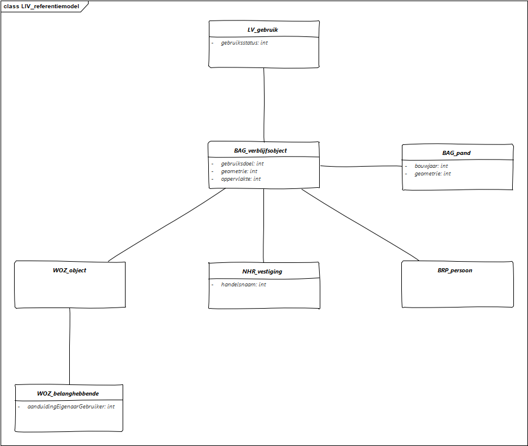
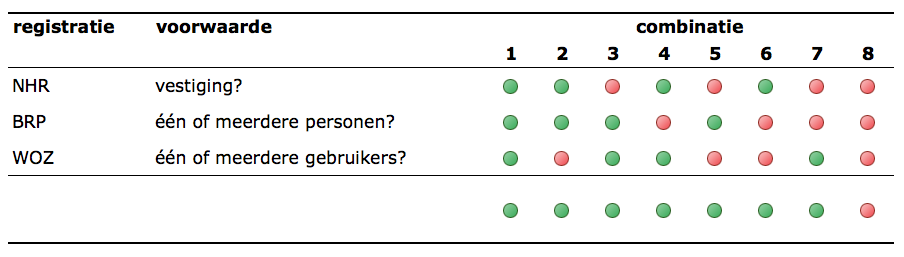

# Data content en structuur
## Algemene uitgangspunten
## UML-diagrammen
### Beschrijving algemeen
#### Referentiemodel
Het Informatiemodel Vastgoedgebruik (IMVG) koppelt verschillende basisregistraties aan elkaar. Op basis van informatie die bronhouders vastleggen in deze registraties, definieert het model vastgoedgebruik. Met andere woorden: het model geeft informatie over de <i>administratieve</i> gebruiksstatus van een verblijfsobject. In [<mark>hoofdstuk 4</mark>] werd die methodiek <mark>al kort</mark> toegelicht. Deze paragraaf een verdere uitwerking van het informatiemodel. 

De LIV maakt gebruik van het [<mark>bron:[stelsel van basisregistraties](https://www.digitaleoverheid.nl/voorzieningen/gegevens/inhoud-basisregistraties/stelselplaat/)</mark>]. Voor het bepalen van gebruik van vastgoed komen de BAG, WOZ, NHR en BRP in aanmerking. Deze registraties kunnen een indicatie geven over de gebruiksstatus van een vastgoedobject. In de LIV staat de BAG centraal. Deze basisregistratie bevat alle adressen en geometrieën van gebouwen in Nederland en voorziet ze van een unieke identificatiecode.

**Figuur x.x: Referentiemodel LIV** (klik op afbeelding voor vergroting)

	
<b>Figuur x.x: Referentiemodel LIV</b> (klik op afbeelding voor vergroting)
	

De andere drie basisregsistraties verwijzen voor locatiegegevens naar de BAG op basis van die identificatiecode. Hierdoor is het mogelijk om informatie uit de andere bronnen rechtstreeks aan een BAG-locatie te koppelen. Dat geeft inzicht in de gebeurtenissen op een locatie. Bovendien voorziet de BAG het gebouwen van aanvullende informatie, zoals: bouwjaar (pand), gebruiksdoel en oppervlakte (verblijfsobject). [<mark>zie gedetailleerdere uitleg onder 4.2</mark>]

Woningen vormen het belangrijkste deel van de gebouwenvoorraad, [<mark>namelijk 80%</mark>]. De BRP legt van alle inwoners van Nederland het woonadres vast [<mark>bron: [Rijksoverheid BRP](https://www.rijksoverheid.nl/onderwerpen/privacy-en-persoonsgegevens/basisregistratie-personen-brp)</mark>]. Hiermee is het mogelijk om te zien of een woning in gebruik is: heeft een woning een tenminste één bewoner, dan staat deze ingeschreven in het BRP. Het BRP verwijst voor het adres naar de BAG. Met andere woorden: koppelt de BAG aan de BRP, dan heeft het BAG-object een gebruiker.

De [<mark>overige 20%</mark>] van de gebouwenvoorraad bestaat uit niet-woningen (kantoren, winkels, scholen, etc.). Het Handelsregister registreert alle bedrijven, rechtspersonen en andere organisaties die deelnemen aan het economisch verkeer in Nederland [<mark>bron: [KvK](https://www.kvk.nl/over-de-kvk/over-het-handelsregister/)</mark>]. Op een vergelijkbare manier als met het BRP is voor de niet-woningen na te gaan of er op een locatie gebruik is: vindt er op een locatie tenminste één economische activiteit plaats, dan staat deze ingeschreven in het NHR. Voor de adresgegevens maakt het register een verwijzing naar de BAG. Daarom is de aanname: koppelt de BAG aan het NHR, dan heeft het BAG-object een gebruiker.

Alle gegevens die nodig zijn om de WOZ-waarde te relateren aan zowel een onroerende zaak als aan een belanghebende zijn opgenomen in de basisregistratie WOZ [<mark>bron: [DigitaleOverheid](https://www.digitaleoverheid.nl/voorzieningen/gegevens/inhoud-basisregistraties/woz/)</mark>]. Voor de adressering van een onroerende zaak maakt de WOZ een koppeling met de BAG.
Grofweg kent de WOZ twee typen belanghebbenden: een *eigenaar* of een *gebruiker*. Een WOZ-object heeft tenminste één eigenaar en geen of meerdere gebruikers hebben. Soms is de eigenaar zelf gebruiker. Maar, het komt ook voor dat eigenaar en gebruiker verschillende personen zijn. In dat geval kan het voorkomen dat een WOZ-object wel een eigenaar, maar geen gebruiker heeft omdat de eigenaar op dat moment geen huurder heeft.

De basisregistratie WOZ beslaat de totale vastgoedvoorraad. Daardoor geeft het extra inzicht in het gebruik van zowel woningen [<mark>kanttekening?</mark>] als niet-woningen. het afleiden van gebruik uit de WOZ, verschilt dus van de manier waarop dat met de BRP en het NHR gebeurt, want daar is de koppeling *an sich* de indicatie voor gebruik. <!-- WEGLATEN: dit heeft geen betrekking op de het informatieproduct, maar op de voorziening (LIV)-->Overigens komt het ook voor dat de WOZ geen uitsluitsel geeft óf dat de WOZ niet kon worden gekoppeld aan de BAG. In dat geval vworden objecten straks uitgesloten van de onderzoekspopulatie: deze objecten tellen dan dus niet mee.

Voeg je de uitkomsten uit de bovenstaande BAG-koppelingen samen, dan zijn er verschillende combinaties mogelijk [<mark>verwijzing tabel onder 3.1.1</mark>]. Indien vanuit geen van de drie bronnen een indicatie van gebruik is, beschouwen we het object als administratief leeg [<mark>tabel</mark>].

**Tabel x.x: Mogelijke combinaties LIV** (klik op afbeelding voor vergroting)

	

### Overzicht
### Verschillende onderdelen uit het UML-diagram
### Consistentie tussen datasets (<mark>optioneel</mark>)
### Identifier management
### Modellering van objectreferenties (<mark>optioneel</mark>)
### Geometrie representatie (<mark>optioneel</mark>)
### Tijdrepresentatie (<mark>optioneel</mark>)
## Objectcatalogus
### Objectencatalogus metadata
### Elementen die in de objectencatalogus gedefinieerd zijn (alfabetisch ordenen)
### Objecttypen
### Datatypen