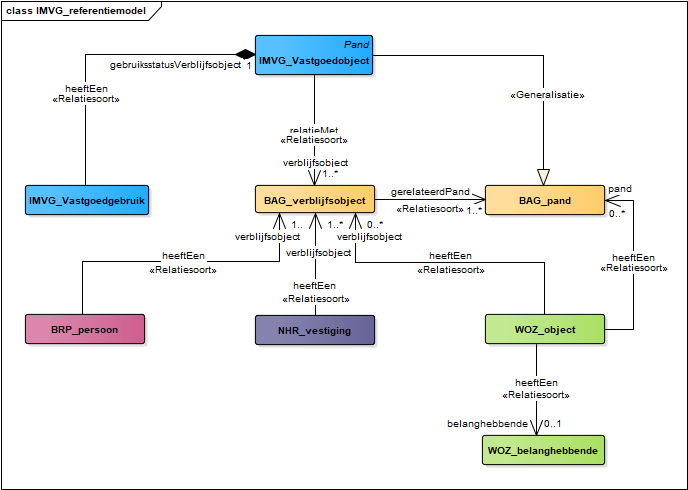
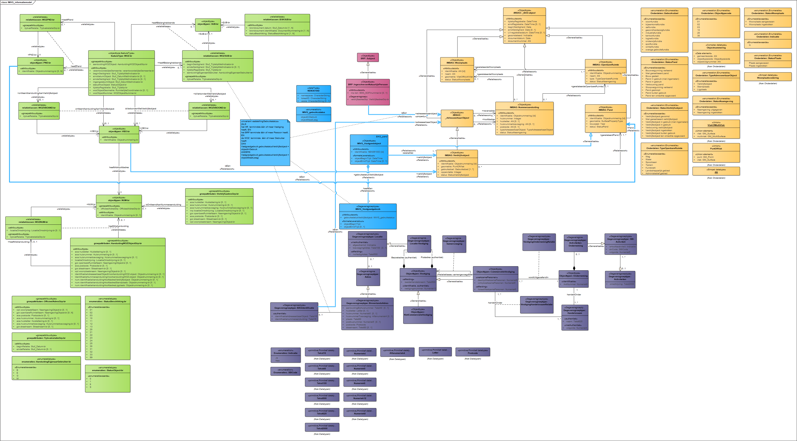

# Data content en structuur

## Inleiding
<!--IMKL 2015 bevat dit kopje extra t.o.v. template-->
[<mark>Structuur zoals in onderstaande alinea's besproken nog ter discussie</mark>]
Dit hoofdstuk beschrijft de inhoud en structuur van het IMVG met behulp van UML-diagrammen en bijbehorende objectcatalogus.

De verschillende uitwisselingsprocessen BAG, WOZ, NHR en BRP worden alleen in dit document behandeld als ze afwijken van hetgeen in de betreffende eigen documentatie is opgenomen. Het IMVG is opgebouwd uit de volgende onderdelen:

- IMVG-Gebruik [<mark>werktitel</mark>]
- IMVG-BAG
- IMVG-WOZ
- IMVG-NHR
- IMVG-BRP

Als eerste geeft dit hoofdstuk een algemene beschrijving aan de hand van het referentiemodel IMVG. Vervolgens gaat het hoofdstuk dieper in op de technische details van het informatiemodel. Het eerste gedeelte van dit hoofdstuk bevat de UML-diagrammen van het referentiemodel en het volledige Informatiemodel Vastgoedgebruik. Objecten, attributen, datatypen en relaties tussen objecten beschrijven eenduidig, schematisch en *in full detail* de inhoudelijke informatie van het informatiemodel. 

Het tweede gedeelte van dit hoofdstuk bevat de objectcatalogus met in tabelvorm dezelfde informatie als in de UML-diagrammen, maar nu met taal beschreven. Alle informatie-elementen zijn daarbij voorzien van definities en waar nodig van een toelichting. De objectcatalogus bevat de gezamenlijke informatie-inhoud van alle onderdelen van het informatiemodel. Met andere woorden: de objectcatalogus maakt dus geen apart onderscheidt tussen de specifieke objecten die toebehoren aan vastgoedgebruik en de objecten uit de bestaande basisregistraties.

## Algemene uitgangspunten
<!--IMKL2015 bevat dit kopje niet t.o.v. template-->
De volgende uitgangspunten lagen ten grondslag aan de modellering van het Informatiemodel Vastgoedgebruik. Hiermee vormden zij de kaders bij het opstellen van het UML-model.

<!--
- [optioneel] 10 principes uit het voorbereiding projectplan opzoeken
- [optioneel] misschien ook nog iets meer afstemmen op taalgebruik in dataspecificatie
-->
- hergebruik van informatie: maak gebruik van basisregistraties; bouw geen volledig nieuw model;
- transparantie: maak zoveel mogelijk gebruik van openbare bronnen en openbare gegevens
- privacy
- eenduidige definities over typen objecten (bijv. vastgoed) en attributen (oppervlakte) en datatypen (bijv. type metrage: gebruiksoppervlak); sluit hiervoor aan bij bestaande definities (per vastgoedsegment) in de markt;
- uniforme methodiek voor het vaststellen van gebruik
- landsdekkend informatie: alle vastgoed binnen NL
- integrale informatie: alle typen vastgoed
- vaststellen gebruiksinformatie (administratief)
- focus op niet-in-gebruik = leegstand
- mogelijkheid om ontwikkelingen in de tijd te kunnen volgen
- mogelijkheid om model in toekomst o.b.v. gebruikswensen uit te breiden met view op en/of extra informatie: generiek of met specifieke extensies voor verschillende doelgroepen

## UML-diagrammen

### Beschrijving algemeen
Het Informatiemodel Vastgoedgebruik is opgebouwd uit verschillende onderdelen. In de kern bestaat een model uit *objecten* met *attributen* en de onderlinge relaties tussen *objecten*. Maar een model kan nog meer onderdelen (stereotypen) bevatten. Al deze onderdelen zijn gedefinieerd en vastgelegd in het <a target="_blank" href="https://docs.geostandaarden.nl/mim/def-st-mim10-20170614" title="Ga naar: documentatie Nationaal Metamodel Informatiemodellering">Nationaal Metamodel Informatiemodellering</a>. In onderstaande tabel zijn alle stereotypen opgenomen met hun definitie. Een uitgebreidere toelichting is opgenomen de documentatie die via bovenstaande link beschikbaar is.

<!--use cellpadding="10" for more space around cell content-->
<figure>
	<table style="width: 100%" valign="top" border="1">
		<col width="20%">
		<col width="20%">
		<col width="60%">
		<tr>
			<th>Stereotype</th>
			<th>Modelelement</th>
			<th>Beschrijving</th>
		</tr>
		<tr>
			<td>Objecttype</td>
			<td>UML-Class</td>
			<td>De typering van een groep objecten (in de werkelijkheid) die binnen een domein relevant zijn en als gelijksoortig worden beschouwd.</td>
		</tr>
		<tr>
			<td>Attribuutsoort</td>
			<td>UML-Property</td>
			<td>De typering van gelijksoortige gegevens die voor een objecttype van toepassing is.</td>
		</tr>
		<tr>
			<td>Gegevensgroep</td>
			<td>UML-Property</td>
			<td>Een typering van een groep van gelijksoortige gegevens die voor een objecttype van toepassing is.</td>
		</tr>
		<tr>
			<td>Gegevensgroeptype</td>
			<td>UML-Class</td>
			<td>Een groep van met elkaar samenhangende attribuutsoorten. Een gegevensgroeptype is altijd een type van een gegevensgroep.</td>
		</tr>
		<tr>
			<td>Generalisatie</td>
			<td>UML-generalization</td>
			<td>De typering van het hiërarchische verband tussen een meer generiek object van een objecttype en een meer specifiek object van een ander objecttype waarbij het laatstgenoemde object eigenschappen van het eerstgenoemde object overerft.</td>
		</tr>
		<tr>
			<td>Relatiesoort</td>
			<td>UML-association</td>
			<td>De typering van het structurele verband tussen een object van een objecttype en een (ander) object van een ander (of hetzelfde) objecttype.</td>
		</tr>
		<tr>
			<td>Relatieklasse</td>
			<td>UML-associationClass</td>
			<td>Een relatiesoort met eigenschappen.</td>
		</tr>
		<tr>
			<td>Externe koppeling</td>
			<td>UML-association</td>
			<td>Een associatie waarmee vanuit het perspectief van het eigen informatiemodel een objecttype uit het ‘eigen’ informatiemodel gekoppeld wordt aan een objecttype van een extern informatiemodel. De relatie zelf hoort bij het ‘eigen’ objecttype.</td>
		</tr>
		<tr>
			<td>Relatierol</td>
			<td>UML-Property</td>
			<td>De benaming van de manier waarop een object deelneemt aan een relatie met een ander object.</td>
		</tr>
		<tr>
			<td>Referentielijst</td>
			<td>UML-Datatype</td>
			<td>Een lijst met een opsomming van de mogelijke domeinwaarden van een attribuutsoort, die buiten het model in een externe waardenlijst worden beheerd. De domeinwaarden in de lijst kunnen in de loop van de tijd aangepast, uitgebreid, of verwijderd worden, zonder dat het informatiemodel aangepast wordt (in tegenstelling tot bij een enumeratie).</td>
		</tr>		
		<tr>
			<td>Referentie element</td>
			<td>UML-Property</td>
			<td>Een eigenschap van een object in een referentielijst in de vorm van een gegeven.</td>
		</tr>
		<tr>
			<td>Enumeratie</td>
			<td>UML-enumeration</td>
			<td>Een datatype waarvan de mogelijke waarden limitatief zijn opgesomd in een statische lijst.</td>
		</tr>
		<tr>
			<td>Enumeratiewaarde</td>
			<td>UML-enumerationLiteral</td>
			<td>Een gedefinieerde waarde, in de vorm van een eenmalig vastgesteld constant gegeven.</td>
		</tr>
		<tr>
			<td>Stereotype «Codelist»</td>
			<td>UML-datatype</td>
			<td>De definitie van een codelist is gelijk aan de definitie van een referentielijst.</td>
		</tr>
		<tr>
			<td>Primitief datatype</td>
			<td>UML-PrimitiveType</td>
			<td>Een in het eigen model gedefinieerd primitieve datatype. Deze worden wel door de modelleur gecreëerd, met een eigen naam en een eigen definitie (en eigen metagegevens).</td>
		</tr>
		<tr>
			<td>Gestructureerd datatype</td>
			<td>UML-property</td>
			<td>Specifiek benoemd gestructureerd datatype dat de structuur van een gegeven beschrijft, samengesteld uit minimaal twee elementen.</td>
		</tr>
		<tr>
			<td>Data element</td>
			<td>UML-property</td>
			<td>Een onderdeel/element van een Gestructureerd datatype die als type een datatype heeft.</td>
		</tr>
		<tr>
			<td>Union</td>
			<td>UML-datatype</td>
			<td>Gestructureerd datatype, waarmee wordt aangegeven dat er meer dan één mogelijkheid is voor het datatype van een attribuut. Het attribuut zelf krijgt als datatype de union. De union biedt een keuze uit verschillende datatypes, elk afzonderlijk beschreven in een union element.</td>
		</tr>		
		<tr>
			<td>Union element</td>
			<td>UML-property</td>
			<td>Een type dat gebruikt kan worden voor het attribuut zoals beschreven in de definitie van Union. Het union element is een onderdeel van een Union, uitgedrukt in een eigenschap (attribute) van een union, die als keuze binnen de Union is gerepresenteerd.</td>
		</tr>
		<tr>
			<td>Extern</td>
			<td>UML-package</td>
			<td>Een groepering van constructies die een externe instantie beheert en beschikbaar stelt aan een informatiemodel en die in het informatiemodel ongewijzigd gebruikt worden.</td>
		</tr>		
		<tr>
			<td>View</td>
			<td>UML-package</td>
			<td>Een groepering van objecttypen die gespecificeerd zijn in een extern informatiemodel en vanuit het perspectief van het eigen informatiemodel inzicht geeft welke gegevens van deze objecttypen relevant zijn binnen het eigen informatiemodel.</td>
		</tr>
		<tr>
			<td>Id</td>
			<td>UML-property</td>
			<td>Aanduiding dat de relatiesoort waarop de «id» is gedefinieerd een onderdeel is van de unieke aanduiding van een objecttype.</td>
		</tr>		
		<tr>
			<td>Constraint</td>
			<td>UML-Constraint</td>
			<td>Een constraint is een conditie of een beperking, die over een of meerdere modelelementen uit het informatiemodel geldt.</td>
		</tr>			
	</table>
	<figcaption> - <mark>Gebruikte stereotypen vanuit het KKG UML-profiel (MIM)</mark></figcaption>
</figure>

Het IMVG maakt gebruik van het <a target="_blank" href="https://www.digitaleoverheid.nl/voorzieningen/gegevens/inhoud-basisregistraties/stelselplaat/" title="Ga naar: Stelselplaat">stelsel van basisregistraties</a> (zie: <mark>figuur 4</mark>). Binnen het IMVG vastgoedgebruik gemodelleerd als de koppeling van de modellen van de basisregistraties WOZ, NHR, BRP aan het model van de BAG. Door deze koppeling ontstaat informatie over het administratieve gebruik. Bovendien bevatten de registraties relevante aanvullende informtie over het object. De volgende paragrafen geven een verdere uiwerking van de verschillende elementen van het IMVG. Eerst volgt een uiteenzetting van de globale structuur aan de hand van het referentiemodel IMVG. Vervolgens wordt de kern van het model: vastgoedgebruik toegelicht aan de hand van een volledig overzicht van het informatiemodel vastgoedgebruik. 

<figure>
	
	<figcaption> - Stelsel van Basisregistraties: stelselplaat (klik voor vergroting)</figcaption>
</figure>

**Referentiemodel**

Het Informatiemodel Vastgoedgebruik (IMVG) koppelt verschillende basisregistraties aan elkaar (zie: <mark>figuur 5</mark>). Het doel en de structuur van deze bronnen bepalen in belangrijke mate de afbakening van het begrip *vastgoedgebruik*. Met andere woorden: het model geeft informatie over de *administratieve* gebruiksstatus van een verblijfsobject (zie: <a href="#informeleBeschrijving" title="Ga naar: Informele beschrijving">paragraaf 4.2</a>). Per bron leggen we hieronder kort uit wat de rol is in het informatiemodel. Tot slot wordt het object *LV-gebruik* kort uitgelegd.

[<mark>Vastgoedobject in referentiemodel opnemen</mark>: pand is specialisatie van vastgoedobject]  

<figure>
	
	<figcaption> - Referentiemodel IMVG (klik voor vergroting)</figcaption>
</figure>

**BAG**

Het Informatiemodel Vastgoedgebruik stelt de BAG centraal. Deze basisregistratie bevat alle adressen en geometrieën van gebouwen in Nederland en voorziet ze van een unieke identificatiecode. De andere drie basisregsistraties verwijzen voor locatiegegevens naar de BAG op basis van die identificatiecode. Hierdoor is het mogelijk om informatie uit de andere bronnen rechtstreeks aan een BAG-locatie te koppelen. Dat geeft inzicht in de gebeurtenissen op een locatie; in dit geval het gebruik. Bovendien voorziet de BAG gebouwen van aanvullende informatie, zoals: bouwjaar (pand), gebruiksdoel en oppervlakte (verblijfsobject).

**BRP**

Woningen vormen het belangrijkste deel van de gebouwenvoorraad, [<mark>namelijk 80%</mark>]. De BRP legt van alle inwoners van Nederland het woonadres vast [<mark>bron: [Rijksoverheid BRP](https://www.rijksoverheid.nl/onderwerpen/privacy-en-persoonsgegevens/basisregistratie-personen-brp)</mark>]. Hiermee is het mogelijk om te zien of een woning in gebruik is. Heeft een woning tenminste één bewoner, dan bevat het BRP op die locatie een inschrijving. Het BRP verwijst voor het adres naar de BAG. Met andere woorden: koppelt de BAG aan de BRP, dan heeft het BAG-object een gebruiker.

**NHR**

De [<mark>overige 20%</mark>] van de gebouwenvoorraad bestaat uit niet-woningen (kantoren, winkels, scholen, etc.). Voor de aanwezigheid van activiteiten op deze locaties kan het Handelsregister geraadpleegd worden. Het Handelsregister registreert alle bedrijven, rechtspersonen en andere organisaties die deelnemen aan het economisch verkeer in Nederland [<mark>bron: [KvK](https://www.kvk.nl/over-de-kvk/over-het-handelsregister/)</mark>]. Op een vergelijkbare manier als met het BRP is voor de niet-woningen na te gaan of er op een locatie gebruik is. Vindt er op een locatie tenminste één economische activiteit plaats, dan bevat het NHR op die locatie tenminste één inschrijving. Voor de adresgegevens maakt het register een verwijzing naar de BAG. Daarom is de aanname: koppelt de BAG aan het NHR, dan heeft het BAG-object een gebruiker.

**WOZ**

Alle gegevens die nodig zijn om de WOZ-waarde te relateren aan zowel een onroerende zaak als aan een belanghebende, zijn ondergebracht in de basisregistratie WOZ [<mark>bron: [DigitaleOverheid](https://www.digitaleoverheid.nl/voorzieningen/gegevens/inhoud-basisregistraties/woz/)</mark>]. Voor de adressering van een onroerende zaak maakt de WOZ een koppeling met de BAG. Grofweg kent de WOZ twee typen belanghebbenden: een *eigenaar* of een *gebruiker*. Een WOZ-object heeft tenminste één eigenaar en geen of meerdere gebruikers. Soms is de eigenaar zelf gebruiker. Maar, als dat niet het geval is, kan het voorkomen dat een WOZ-object wel een eigenaar, maar geen gebruiker heeft.

De basisregistratie WOZ beslaat de totale vastgoedvoorraad (woningen en niet-woningen). Daardoor geeft het extra inzicht in het gebruik van zowel woningen [<mark>kanttekening?</mark>] als niet-woningen. Het afleiden van gebruik uit de WOZ, verschilt dus van de manier waarop dat met de BRP en het NHR gebeurt, want daar is de koppeling *an sich* de indicatie voor gebruik. <!-- WEGLATEN: dit heeft geen betrekking op de het informatieproduct, maar op de voorziening (LIV)-->Overigens komt het ook voor dat de WOZ geen uitsluitsel geeft óf dat de WOZ niet koppelt aan de BAG. Hier houdt de huidige versie van het IMVG nog geen rekening mee.

**Vastgoedgebruik**

Voeg je de uitkomsten uit de bovenstaande BAG-koppelingen samen, dan zijn er verschillende combinaties mogelijk (zie: <mark>figuur 4</mark>). Indien vanuit geen van de drie bronnen een indicatie van gebruik is, geldt het object als administratief leeg (combinatie 8). In de overige gevallen gaat het informatiemodel uit van gebruik (combinatie 1-7).

<figure>
	
	<figcaption> - Mogelijke combinaties gebruiksstatus IMVG (klik voor vergroting)</figcaption>
</figure>

### Overzicht
Het onderstaand UML-diagram bevat het complete Informatiemodel Vastgoedgebruik, inclusief de relatie met de basisregistraties BAG, WOZ, NHR en BRP. De tabel licht het kleurgebruik in het UML-diagram toe. De volgende paragrafen lichten telkens een deel van het diagram toe. Het IMVG neemt van elke basisregistratie slecht een deel van de inhoud over en voegt daar de specifieke informatie an toe die nodig is vor de realisatie van de in de scope genoemde processen. Dit heet een *view*; het IMVG heeft als het ware een eigen 'kijk' op de informatie in de basisregistraties, namelijk vanuit het perspectief vastgoedgebruik.

<figure>
	<table style="width: 100%" cellpadding="10" border="1">
	<col width="15%">
	<col width="85%">
		<tr>
			<th>Kleur</th>
			<th>Uitleg</th>
		</tr>
		<tr>
			<td>Groen</td>
			<td>Landelijke Voorziening Waarde Onroerende Zaken</td>
		</tr>		
		<tr>
			<td>Blauw</td>
			<td>Informatiemodel Vastgoedgebruik</td>
		</tr>
		<tr>
			<td>Oranje</td>
			<td>Landelijke Voorziening Basisregistratie Adressen en Gebouwen</td>
		</tr>
		<tr>
			<td>Paars</td>
			<td>Basisregistratie Nationaal Handelsregister</td>
		</tr>
		<tr>
			<td>Roze</td>
			<td>Basisregistratie Personen/Gemeentelijke Basisadministratie</td>
		</tr>
	</table>
	<figcaption> - Kleurgebruik in UML diagrammen</figcaption>
</figure>

<figure>
	
	<figcaption> - Informatiemodel IMVG (klik voor vergroting)</figcaption>
</figure>

**Objecten, attributen en relaties**

<!--Dataverkeer (zie IMKL) nog opnemen? Lijkt nu (nog) niet relevant.-->
Het UML-diagram toont de informatie die nodig is voor de indicatie van administratief vastgoedgebruik. Ook bevat het model alle gegevens uit de basisregistraties BAG, WOZ, NHR en BRP die vastgoedobject van relevante extra kenmerken voorziet (bijv. aantal vierkante meters in gebruik of leegstaand). Daarom zijn in het model ook de relaties met (delen van) deze basisregistraties opgenomen in het model. Aan de linkerkant bevindt zich de IMVG view op het informatiemodel van de LV WOZ (groen). Het deelmodel rechtsboven geeft in de IMVG view op de LV BAG weer (oranje). Rechtsonder toont de IMVG view op de NHR (paars). Het deelmodel middenboven geeft gestalte aan de IMVG view op het BRP/GBA.

De kern van het model, vastgoedgebruik, bevindt zich in het midden van het diagram (blauw). Vastgoedgebruik wordt gegenereerd op het koppelvlak van de vier basisregistraties. Het IMVG-objecttype vastgoedgebruik koppelt de verschillende basisregistraties aan elkaar op basis van het objecttype verblijfsobject uit de BAG. Dat object fungeert in alle basisregistraties als unieke koppelsleutel. Voor de leesbaarheid zijn de datatypen, gegevensgroepen en waardelijsten van de basisregistraties niet het overzicht opgenomen.

Het objecttype *vastgoedobject* is bijvoorbeeld een specialisatie van het objecttype *pand* uit de BAG. Het IMVG modelleert specifiek de administratieve gebruiksstatus van *panden met een verblijfsobject*. Het objecttype *pand* uit de BAG bevat echter ook standplaatsen, ligplaatsen en ongeadresseerde objecten (bijgebouwen). Maar, die typen panden vallen buiten de scope van het informatiemodel. Daarom is het specifieke objecttype *vastgoedobject* gecreëerd. Via de relaties met *verblijfsobject* en *pand* erf het objecttype *vastgoedobject* de geometrieën en andere attributen uit de BAG. Hierdoor is het mogelijk administratief gebruik (en dus ook leegstand) op gebouwniveau weer te geven op een kaart.

Naast het vastgoedobject is ook het objecttype *vastgoedgebruik* opgenomen. Dit objecttype bevat, naast een aantal administratief relevante attributen, ook het attribuut *gebruiksstatusVerblijfsobject*. Dit is het centrale gegeven van het informatiemodel. Via dit objecttype worden de registraties aan elkaar gekoppeld. Dit element heeft daarom een relatie met de verblijfsobjectidentificatie uit elke registratie. Voor de koppeling met het NHR en het BRP geldt dat wanneer de koppeling met de BAG voor één van deze registraties slaagt (de registratie bevat een relatie met een verblijfsobject in de BAG), is er sprake van gebruik.

De koppeling met de WOZ ziet anders uit. De WOZ heeft per definitie een link met een verblijfsobject in de BAG. Relevant is echter om te controleren of een verblijfobject naast een eigenaar ook daadwerkelijk een gebruiker heeft. Koppelt één van de andere registraties niet, maar wordt er wel ee ngebruiker in de WOZ gevonden, dan is er sprake van administratief gebruik. Slechts in het geval waarin via het NHR en BRP geen link kan worden gelegd met de BAG én in de WOZ geen gebruiker wordt gevonden is er sprake van administratieve leegstand. Deze voorwaarde is weergegeven in het blauwe element *contraint note* «Pre-condition».

De mogelijke waarden (*objectInGebruik* of *objectStaatLeeg*) zijn weergegeven in de waardelijst *gebruiksStatus*. Naast de relaties met de vier basisregistraties heeft het objecttype *vastgoedgebruik* ook een relatie met het objecttype *vastgoedobject*. In principe zou via het verblijfsobject de relatie met het pand gelegd kunnen worden, maar omdat het IMVG specifiek kijkt naar een deelpopulatie (vastgoedobjecten), is een directe relatie gelegd tussen het objecttype *vastgoedgebruik* en *vastgoedobject*. Het belang van de keuze komt voort uit de <a href="#dataspecificatie" title="Ga naar: Dataspecificatie">toepassing</a> van de gegevens. 

**Waardelijsten**

Waardelijsten die als datatype «codeList» zijn opgenomen in de IMVG-view op de basisregistraties worden niet in het UML beheerd, maar in externe waardelijsten. Deze waardelijsten behoren toe aan andere bronhouders en worden derhalve niet binnen het IMVG en vallen daarmee buiten de scope van dit model.

Meer in het algemeen geldt dat waardelijsten van het type «enumeration» binnen het model zijn opgenomen en dat waardelijsten van het type «codeList» extern worden opgenomen, ook als ze wel onderdeel uitmaken van het inhoudelijke beheer van het IMVG. Dit gebeurt om twee redenen: [1] om het model leesbaar te houden (de startversies van de lijsten zijn wel opgenomen [<mark>Klopt dat in IMVG?</mark>]) en [2] omdat waardelijsten van het type «codeList» per definitie aan verandering onderhevig zijn. Met andere woorden: dynamische waardelijsten, worden uit de UML-beschrijving gehaald.

**Basisattributen voor identificatie**

Alle concrete objecttypen en daarmee objecten in een dataset hebben een attribuut voor identificatie. Met deze identificatie kunne ze uniek geïdentificeerd worden. Het Nationaal metamodel voor informatiemodellering hanteert hiervoor het attribuut Id. Niet alle informatiemodellen waren KKG-compliant in UML beschikbaar. Omdat ervoor gekozen is om bij de modellering van het IMVG, de oorspronkelijke modelleringsconcepten in tact te laten, is de identificatie *an sich* wel gewaarbord, alleen gebeurt dit binnen het model niet op een uniforme manier [<mark>Klopt dit?</mark>].

Verder beschikken de objecten in de dataset over verschillende attributen met temporele informatie. Omdat gebruik is gemaakt van verschillende basisregistraties die semantisch (nog) niet op elkaar zijn afgestemd kan de benaming van dit attribuut onderling verschillen. Bovendien is het attribuut binnen sommige registraties generiek (bijv. BAG) en binnen andere registraties specifiek (bijv. NHR). Kortom, de benodigde temporele informatie is binnen de modellen aanwezig, maar niet eenduidig.

<!--

WOZ

WOZ-object
beginGeldigheid, eindeGeldigheid
ingangsdatumObject, einddatumObject

WOZ-belanghebbende
beginGeldigheid, eindeGeldigheid

NHR
VestigingOndernemingRelatie **controleren**

BRP
ingangsdatumGeldigheid (waarschijnlijk)

BAG
beginGeldigheid, eindeGeldigheid
tijdstipRegistratie, eindRegistratie

-->

<!--### Verschillende onderdelen uit het UML-diagram (<mark>semantische kern?</mark>)
### Consistentie tussen datasets (<mark>optioneel</mark>)

### Identifier management
[<mark>Moet vastgoedgebruik nog identifier hebben?</mark>]

### Modellering van objectreferenties (<mark>optioneel</mark>)
### Geometrie representatie (<mark>optioneel</mark>)
### Tijdrepresentatie (<mark>optioneel</mark>)

### Tijdrepresentatie en temporeelmodel
[<mark>Moet vastgoedgebruik nog beginGeldigheid, eindeGeldigheid hebben?</mark>]-->

## Objectcatalogus
[<mark>Volgt nog!</mark>]
### Objectencatalogus metadata
### Elementen die in de objectencatalogus gedefinieerd zijn (alfabetisch ordenen)
### Objecttypen
### Datatypen

